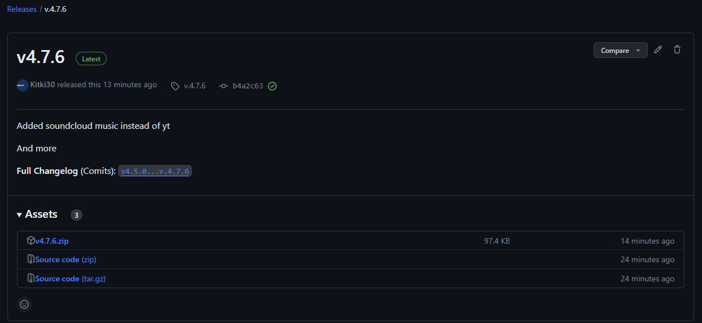

# Downloading latest release

To host bot you need to download latest release of Mechownik bot!

Download it here: [https://github.com/Kitki30/Mechownik/releases/latest](https://github.com/Kitki30/Mechownik/releases/latest)

You should see something like this:

<figure><figcaption></figcaption></figure>

Download file named "v\[major-version].\[minor-version].\[patch-version].zip"

Ready?

Unpack file with windows explorer or any program with zip archives support

Now go to next page:


[editing-configuration.md](editing-configuration.md)

