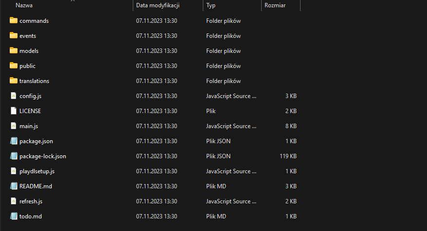

# Editing Configuration

Go to folder that you unpacked.

You should see something like this:

<figure><figcaption>
Screenshot of files from v4.7.6
</figcaption></figure>

Open "config.js" file with Visual Studio Code:\
You should see something like this:

<figure><figcaption>
Screenshot of config.js file
</figcaption></figure>

Set settings to your needs. Everything is commented with description of setting.

If you are ready, go to next page:


[setting-eviroment-variables.md](setting-eviroment-variables.md)


Or for Replit:


[setting-eviroment-variables-replit.md](setting-eviroment-variables-replit.md)


