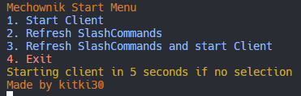

# Running bot

Running bot:

Before you start bot, you need to install packages using this command (This step is required only after installing new version or first start):

```
npm install
```


There are three commands you can run to start the bot:\
\
Command 1, Run with nodemon(Recomended):

```bash
npx nodemon main.js
```

Command 2, Run with npm package manager:

```bash
npm run run
```

Command 3, Run directly with node.js:

```bash
node main.js
```

Now you should see something like this:

<figure><figcaption></figcaption></figure>

It's Mechownik Start Menu!

From here you can:\
Start Client(Bot)

Refresh SlashCommands

Refresh SlashCommands and start Client(Bot)

Exit

To select option type number in console and press enter.

If you dont select option in five seconds Client will start!

Now bot should work!


[inviting-bot-to-your-server.md](inviting-bot-to-your-server.md)

